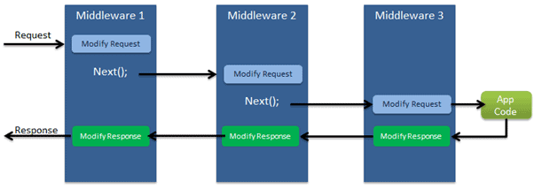
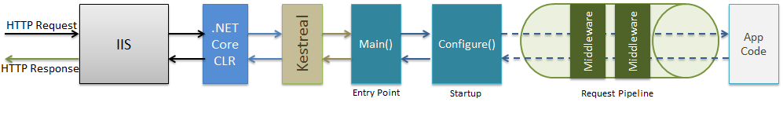
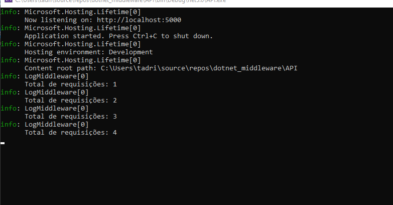

# .NET 5 Middleware 

O *.NET* veio com um novo conceito chamado Middleware. Um middleware de maneira simples, é uma classe que vai ser chamada a cada requisição da aplicação. 

A seguir você tem uma imagem demonstrando o fluxo de uma requisição de um middler:

.

Como você pode ver, os middlers criam uma pipeline de requisições HTTP do Request ao Response. A seguir você tem uma imagem demonstrando como o .NET processa essas requisições:

.


# Exemplo

Para ficar mais claro, nesse repositório você tem um exemplo de criação de um middler para calcular quantas vezes uma aplicação foi requisitada. 

O .NET tem um template que já cria uma classe middler, eu adicionei nesse template a interface `ILogger` e uma variavel estática chamada `count`.

```Csharp
/*
 ./Comum/LogMiddleware.cs
 */

  public class LogMiddleware
    {
        private readonly RequestDelegate _next;
        //Estamos injetando a Interface ILogger para ver o resultado na console
        private readonly ILogger _logger;

       //Criamos a variavel count como int para calcular cada requisição a nossa aplicação
        private static int count = 0;


        public LogMiddleware(RequestDelegate next, ILoggerFactory logger)
        {
            _next = next;
            _logger = logger.CreateLogger("LogMiddleware");

        }

        //Esse método abaixo sera chamado toda vez que a aplicação for requisitada
        public Task Invoke(HttpContext httpContext)
        {
            count++;
            _logger.LogInformation($"Total de requisições: {count}");

            return _next(httpContext);
        }
    }

    // Extension method used to add the middleware to the HTTP request pipeline.
    public static class LogMiddlewareExtensions
    {
        public static IApplicationBuilder UseLogMiddleware(this IApplicationBuilder builder)
        {
            return builder.UseMiddleware<LogMiddleware>();
        }
    }
```

Para registrar o `UseLogMiddleware`, basta chamar ele no método `Configure` da classe `Startup`.

```Csharp
public void Configure(IApplicationBuilder app, IWebHostEnvironment env)
        {
           
            //outras implementações
            app.UseLogMiddleware();            
            //outras implementações
        }
```

## Testando aplicação
Executando o projeto e realizando alguns requests na rota `http://localhost:5000/WeatherForecast`, você pode ver na console o log das nossas requisições:

.
